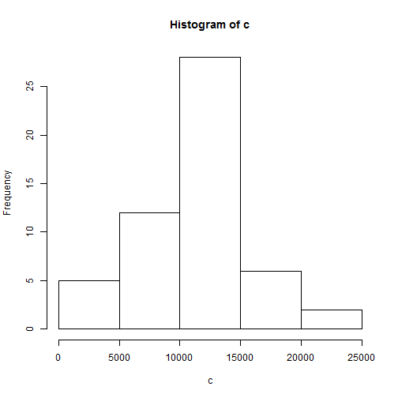
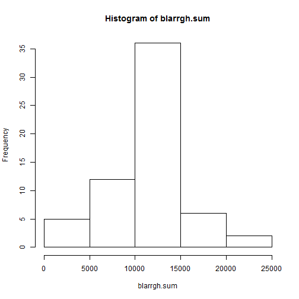
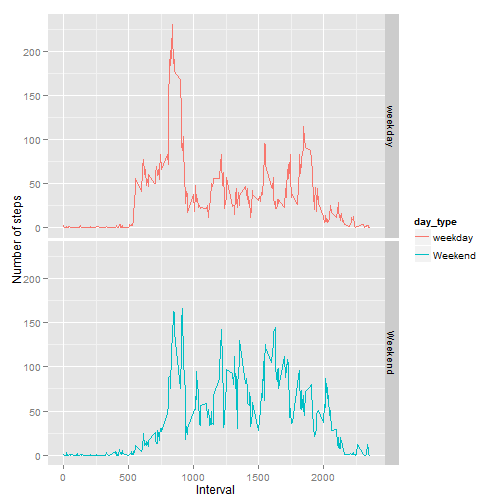
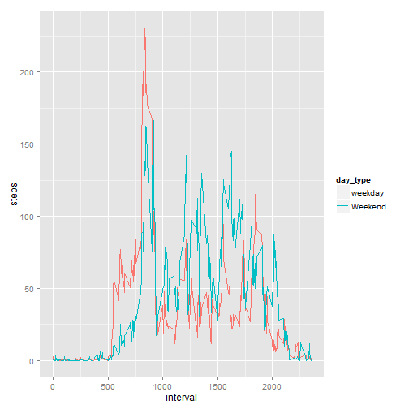

What is mean total number of steps taken per day? **Bold**

1 Plotting a Histogram of steps taken per day

```r
download.file("http://d396qusza40orc.cloudfront.net/repdata%2Fdata%2Factivity.zip", destfile="activity.zip")
unzip("activity.zip")
a<-read.csv("activity.csv")

#remove na 
b<-a[complete.cases(a),]
#b[is.na(b)]<-0
attach(b)
```

```
## The following objects are masked from imputed (pos = 3):
## 
##     date, interval, steps
## 
## The following objects are masked from imputed (pos = 4):
## 
##     date, interval, steps
## 
## The following objects are masked from interval_steps (pos = 5):
## 
##     interval, steps
## 
## The following objects are masked from b (pos = 6):
## 
##     date, interval, steps
## 
## The following objects are masked from imputed (pos = 7):
## 
##     date, interval, steps
## 
## The following objects are masked from imputed (pos = 8):
## 
##     date, interval, steps
## 
## The following objects are masked from interval_steps (pos = 9):
## 
##     interval, steps
## 
## The following objects are masked from b (pos = 10):
## 
##     date, interval, steps
## 
## The following objects are masked from imputed (pos = 11):
## 
##     date, interval, steps
## 
## The following objects are masked from imputed (pos = 12):
## 
##     date, interval, steps
## 
## The following objects are masked from interval_steps (pos = 13):
## 
##     interval, steps
## 
## The following objects are masked from b (pos = 14):
## 
##     date, interval, steps
## 
## The following objects are masked from imputed (pos = 17):
## 
##     date, interval, steps
## 
## The following objects are masked from imputed (pos = 18):
## 
##     date, interval, steps
## 
## The following objects are masked from interval_steps (pos = 19):
## 
##     interval, steps
## 
## The following objects are masked from b (pos = 20):
## 
##     date, interval, steps
## 
## The following objects are masked from imputed (pos = 21):
## 
##     date, interval, steps
## 
## The following objects are masked from interval_steps (pos = 22):
## 
##     interval, steps
## 
## The following objects are masked from b (pos = 23):
## 
##     date, interval, steps
## 
## The following objects are masked from imputed (pos = 25):
## 
##     date, interval, steps
## 
## The following objects are masked from interval_steps (pos = 26):
## 
##     interval, steps
## 
## The following objects are masked from b (pos = 27):
## 
##     date, interval, steps
```

```r
#determine the sum per day
c<-tapply(b$steps, date, sum )
c<-c[complete.cases(c)]


#histogram!!!!!
hist(c)
```

 


2 Finding the mean and median steps taken per day

```r
#self-explainatory
mean(c)
```

```
## [1] 10766
```

```r
median(c)
```

```
## [1] 10765
```

What is the average daily activity pattern? **bold**

1)Make a time series plot (i.e. type = "l") of the 5-minute interval (x-axis) and the average number of steps taken, averaged across all days (y-axis)


```r
interval_steps <- aggregate(steps ~ interval, b, mean)
plot(interval_steps, type="l")
```

 


2)Which 5-minute interval, on average across all the days in the dataset, contains the maximum number of steps?


```r
attach(interval_steps)
```

```
## The following objects are masked from b (pos = 3):
## 
##     interval, steps
## 
## The following objects are masked from imputed (pos = 4):
## 
##     interval, steps
## 
## The following objects are masked from imputed (pos = 5):
## 
##     interval, steps
## 
## The following objects are masked from interval_steps (pos = 6):
## 
##     interval, steps
## 
## The following objects are masked from b (pos = 7):
## 
##     interval, steps
## 
## The following objects are masked from imputed (pos = 8):
## 
##     interval, steps
## 
## The following objects are masked from imputed (pos = 9):
## 
##     interval, steps
## 
## The following objects are masked from interval_steps (pos = 10):
## 
##     interval, steps
## 
## The following objects are masked from b (pos = 11):
## 
##     interval, steps
## 
## The following objects are masked from imputed (pos = 12):
## 
##     interval, steps
## 
## The following objects are masked from imputed (pos = 13):
## 
##     interval, steps
## 
## The following objects are masked from interval_steps (pos = 14):
## 
##     interval, steps
## 
## The following objects are masked from b (pos = 15):
## 
##     interval, steps
## 
## The following objects are masked from imputed (pos = 18):
## 
##     interval, steps
## 
## The following objects are masked from imputed (pos = 19):
## 
##     interval, steps
## 
## The following objects are masked from interval_steps (pos = 20):
## 
##     interval, steps
## 
## The following objects are masked from b (pos = 21):
## 
##     interval, steps
## 
## The following objects are masked from imputed (pos = 22):
## 
##     interval, steps
## 
## The following objects are masked from interval_steps (pos = 23):
## 
##     interval, steps
## 
## The following objects are masked from b (pos = 24):
## 
##     interval, steps
## 
## The following objects are masked from imputed (pos = 26):
## 
##     interval, steps
## 
## The following objects are masked from interval_steps (pos = 27):
## 
##     interval, steps
## 
## The following objects are masked from b (pos = 28):
## 
##     interval, steps
```

```r
interval_steps[which.max(interval_steps$steps),]
```

```
##     interval steps
## 104      835 206.2
```

Note that there are a number of days/intervals where there are missing values (coded as NA). The presence of missing days may introduce bias into some calculations or summaries of the data.**bold**

1)Calculate and report the total number of missing values in the dataset (i.e. the total number of rows with NAs)

```r
ab<-is.na(a)
sum(ab)
```

```
## [1] 2304
```

2) Devise a strategy for filling in all of the missing values in the dataset. The strategy does not need to be sophisticated. For example, you could use the mean/median for that day, or the mean for that 5-minute interval, etc.

```r
#replace NAs with mean of same interval over all days
```


3) Create a new dataset that is equal to the original dataset but with the missing data filled in.

```r
library(plyr)

imputed <- adply(a, 1, function(x) if (is.na(x$steps)) {
    x$steps = round(interval_steps[interval_steps$interval == x$interval, 2])
    x
} else {
    x
})
```

4) Make a histogram of the total number of steps taken each day and Calculate and report the mean and median total number of steps taken per day. Do these values differ from the estimates from the first part of the assignment? What is the impact of imputing missing data on the estimates of the total daily number of steps?

```r
attach(imputed)
```

```
## The following objects are masked from interval_steps (pos = 3):
## 
##     interval, steps
## 
## The following objects are masked from b (pos = 4):
## 
##     date, interval, steps
## 
## The following objects are masked from imputed (pos = 5):
## 
##     date, interval, steps
## 
## The following objects are masked from imputed (pos = 6):
## 
##     date, interval, steps
## 
## The following objects are masked from interval_steps (pos = 7):
## 
##     interval, steps
## 
## The following objects are masked from b (pos = 8):
## 
##     date, interval, steps
## 
## The following objects are masked from imputed (pos = 9):
## 
##     date, interval, steps
## 
## The following objects are masked from imputed (pos = 10):
## 
##     date, interval, steps
## 
## The following objects are masked from interval_steps (pos = 11):
## 
##     interval, steps
## 
## The following objects are masked from b (pos = 12):
## 
##     date, interval, steps
## 
## The following objects are masked from imputed (pos = 13):
## 
##     date, interval, steps
## 
## The following objects are masked from imputed (pos = 14):
## 
##     date, interval, steps
## 
## The following objects are masked from interval_steps (pos = 15):
## 
##     interval, steps
## 
## The following objects are masked from b (pos = 16):
## 
##     date, interval, steps
## 
## The following objects are masked from imputed (pos = 19):
## 
##     date, interval, steps
## 
## The following objects are masked from imputed (pos = 20):
## 
##     date, interval, steps
## 
## The following objects are masked from interval_steps (pos = 21):
## 
##     interval, steps
## 
## The following objects are masked from b (pos = 22):
## 
##     date, interval, steps
## 
## The following objects are masked from imputed (pos = 23):
## 
##     date, interval, steps
## 
## The following objects are masked from interval_steps (pos = 24):
## 
##     interval, steps
## 
## The following objects are masked from b (pos = 25):
## 
##     date, interval, steps
## 
## The following objects are masked from imputed (pos = 27):
## 
##     date, interval, steps
## 
## The following objects are masked from interval_steps (pos = 28):
## 
##     interval, steps
## 
## The following objects are masked from b (pos = 29):
## 
##     date, interval, steps
```

```r
blarrgh.sum<-tapply(imputed$steps,date, sum )

hist(blarrgh.sum)
```

 

```r
mean(blarrgh.sum)
```

```
## [1] 10766
```

```r
median(blarrgh.sum)
```

```
## [1] 10762
```

Are there differences in activity patterns between weekdays and weekends?**bold**


For this part the weekdays() function may be of some help here. Use the dataset with the filled-in missing values for this part.


1) Create a new factor variable in the dataset with two levels - "weekday" and "weekend" indicating whether a given date is a weekday or weekend day.


```r
attach(imputed)
```

```
## The following objects are masked from imputed (pos = 3):
## 
##     date, interval, steps
## 
## The following objects are masked from interval_steps (pos = 4):
## 
##     interval, steps
## 
## The following objects are masked from b (pos = 5):
## 
##     date, interval, steps
## 
## The following objects are masked from imputed (pos = 6):
## 
##     date, interval, steps
## 
## The following objects are masked from imputed (pos = 7):
## 
##     date, interval, steps
## 
## The following objects are masked from interval_steps (pos = 8):
## 
##     interval, steps
## 
## The following objects are masked from b (pos = 9):
## 
##     date, interval, steps
## 
## The following objects are masked from imputed (pos = 10):
## 
##     date, interval, steps
## 
## The following objects are masked from imputed (pos = 11):
## 
##     date, interval, steps
## 
## The following objects are masked from interval_steps (pos = 12):
## 
##     interval, steps
## 
## The following objects are masked from b (pos = 13):
## 
##     date, interval, steps
## 
## The following objects are masked from imputed (pos = 14):
## 
##     date, interval, steps
## 
## The following objects are masked from imputed (pos = 15):
## 
##     date, interval, steps
## 
## The following objects are masked from interval_steps (pos = 16):
## 
##     interval, steps
## 
## The following objects are masked from b (pos = 17):
## 
##     date, interval, steps
## 
## The following objects are masked from imputed (pos = 20):
## 
##     date, interval, steps
## 
## The following objects are masked from imputed (pos = 21):
## 
##     date, interval, steps
## 
## The following objects are masked from interval_steps (pos = 22):
## 
##     interval, steps
## 
## The following objects are masked from b (pos = 23):
## 
##     date, interval, steps
## 
## The following objects are masked from imputed (pos = 24):
## 
##     date, interval, steps
## 
## The following objects are masked from interval_steps (pos = 25):
## 
##     interval, steps
## 
## The following objects are masked from b (pos = 26):
## 
##     date, interval, steps
## 
## The following objects are masked from imputed (pos = 28):
## 
##     date, interval, steps
## 
## The following objects are masked from interval_steps (pos = 29):
## 
##     interval, steps
## 
## The following objects are masked from b (pos = 30):
## 
##     date, interval, steps
```

```r
idate<-(as.Date(imputed$date))
day<-weekdays(idate)
imputed2<-cbind(imputed,day)

# mark weekdays and weekends
imputed2$day_type <- c("weekday")

for (i in 1:nrow(imputed2)) 
  {
  if (imputed2$day[i]== "Saturday" || imputed2$day[i]=="Sunday")     
{imputed2$day_type[i]<-"Weekend"
}
}


imputed$day_type <- as.factor(imputed2$day_type)
```

2) Make a panel plot containing a time series plot (i.e. type = "l") of the 5-minute interval (x-axis) and the average number of steps taken, averaged across all weekday days or weekend days (y-axis). The plot should look something like the following, which was creating using simulated data:  


```r
#panel plot with time series 5 min interval on x axis and average number of steps (averaged accross all weekday days or weekend days) on y axxis

agimputed<-aggregate((steps~interval+day_type), imputed2,mean  )
library(ggplot2)


p1 <- ggplot(agimputed, aes(x = interval, y = steps, colour=day_type)) + geom_line() + facet_grid(day_type ~ .) + labs(x = "Interval", y = "Number of steps")
p1
```

 

```r
p2 <- ggplot(agimputed, aes(x=interval,y= steps, colour = day_type))+geom_line()

p2
```

 
as you can see, overall weekends seem to have more steps than weekdays, but for certain intervals steps taken on weekdays is higher, during earlier and later periods. This seems to indicate that the person has to walk a relatively long distance to reach his workplace. Strangely, this is less so in the late period. Perhaps he carpools on his way  home.
